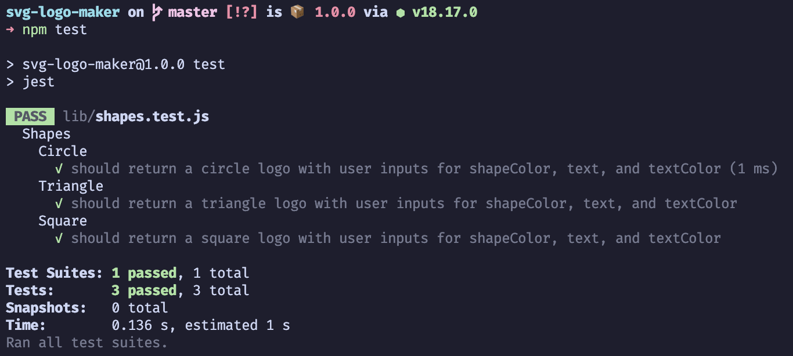

<div align="center">

# SVG Logo Maker

[](https://github.com/manc1n1/svg-logo-maker/blob/master/LICENSE)
[![nodejs][node.js]][nodejs-url]
[![nodejs][jestjs]][jestjs-url]

</div>

## Description

Object-oriented Programming Challenge: SVG Logo Maker

-   Generate a SVG logo with Node.js
-   Demo [video](https://drive.google.com/file/d/1i-A0VWMDI6v1o0NdStcbXWr0CHLe1AKv/view?usp=drive_link)

https://github.com/manc1n1/svg-logo-maker/assets/18316547/3a2e994e-8d6a-4c1a-b522-486fc9a7856b

## Table of Contents

-   [Installation](#installation)
-   [Usage](#usage)
-   [Tests](#tests)
-   [Contributing](#contributing)
-   [License](#license)
-   [Contact](#contact)

## Installation

1.  Clone the repo

    ```sh
    git clone https://github.com/manc1n1/svg-logo-maker.git
    ```

2.  Change directories to `svg-logo-maker`

    ```sh
    cd svg-logo-maker
    ```

3.  Install NPM packages

    ```sh
    npm install
    ```

4.  Install NPM dev dependencies

    ```sh
    npm install --save-dev jest
    ```

## Usage

1. Change directories to where you cloned the repo

    ```sh
    cd path/to/svg-logo-maker
    ```

2. Run `index.js`

    ```sh
    node index.js
    ```

3. Refer to [video](https://drive.google.com/file/d/1i-A0VWMDI6v1o0NdStcbXWr0CHLe1AKv/view?usp=drive_link)

## Tests

1.  Change directories to where you cloned the repo

    ```sh
    cd path/to/svg-logo-maker
    ```

2.  Run `Jest` tests

    ```sh
    npm test
    ```



## Contributing

Contributions are what make the open source community such an amazing place to learn, inspire, and create. Any contributions you make are **greatly appreciated**.

If you have a suggestion that would make this better, please fork the repo and create a pull request. You can also simply open an issue with the tag "enhancement".
Don't forget to give the project a star! Thanks again!

1. Fork the Project
2. Create your Feature Branch (`git checkout -b feature/AmazingFeature`)
3. Commit your Changes (`git commit -m 'Add some AmazingFeature'`)
4. Push to the Branch (`git push origin feature/AmazingFeature`)
5. Open a Pull Request

## License

[MIT License](https://opensource.org/licenses/MIT)

## Contact

-   Email mancinij1111@gmail.com
-   GitHub [manc1n1](https://github.com/manc1n1)

[node.js]: https://img.shields.io/badge/node.js-333?style=for-the-badge&logo=nodedotjs
[nodejs-url]: https://nodejs.org/
[jestjs]: https://img.shields.io/badge/jest-C21325?style=for-the-badge&logo=jest
[jestjs-url]: https://jestjs.io/
